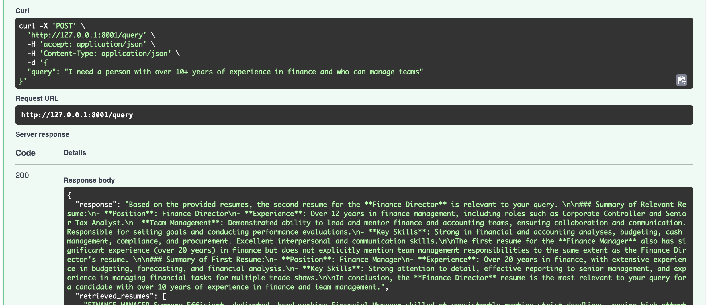

# RAG System with FAISS and SQLite

## Overview

RAG using faiss and sqlite. Why not langchain? I understand this code might be a bit difficult to set up initially and is not the best currently, but once set up properly, organized and optimized more, it can help to keep the pipeline more stable, give more control and flexibility. Langchain like frameworks have too many breaking updates and are unnecessarily complicated. It can be expanded for hybrid search using fts on sqlite, we can add other things like reranking,support for other llms(can be organized and optimized more).

## Detailed Solution

### Pre processing

1. **Clean the data**: Used clean_text to clean the data.
2. **Chunking**: For the resume task, I did not want to divide any single resume into chunks. I would prefer to summarize the resume into a short chunk as I feel that makes more sense and store embedding for every summarized resume into vector db. However, for now I used an embedding model that can expand to 8192 tokens so i can embed majority of the resume without summarizing.

### FAISS Index Setup

1. **Creating the Index**: Use `IndexIDMap2`over flat(IndexFlatL2) to create and manage vectors.
2. **Serializing the Index**: Serialize the FAISS index to save it locally.
3. **Deserializing the Index**: Load the FAISS index from the serialized file when needed.

### SQLite Metadata Management

1. **Creating the Database**: Initialize a SQLite database with a table to store metadata.
2. **Inserting Metadata**: Add records with IDs that correspond to FAISS vector IDs.
3. **Querying Metadata**: Retrieve metadata based on vector IDs obtained from FAISS searches.

### Example Workflow

**Perform query**:
    - Query FAISS to find nearest neighbors for a given vector.
    - Use the resulting IDs to query SQLite and retrieve metadata.
    - Send the context to llm along with the query.

**Preprocessing**:
    - Place the final data folder(containg resume for different domains) in the root if you intend to run the code for preprocessing again. However, I have the index and the db here. So, it is possible to run and test against a query without any preprocessing.

**Structure**:
    - vector_utils.py (faiss related code)
    - embed.py (embedding model)
    - process_data.py (prerocessing pipeline and data processing related code)
    - llm_utils.py (llm related code)
    - prompts.py (prompt related code)
    - data_utils.py (utility function to read pdfs)
    - app.py (fastapi)

## Installation

Import the conda environment 'environment.yml'.

## Run
    - uvicorn app:app --host 127.0.0.1 --port 8001 --reload   
    - set key in .env
    - open  127.0.0.1/docs

